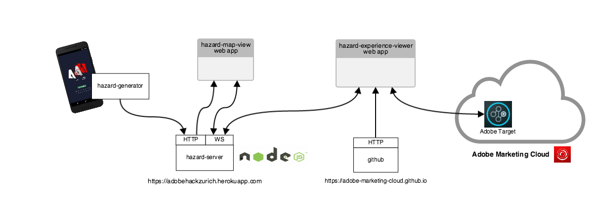

Adobe Target & PhoneGap @ HackZurich
====================================

# Scope

At HackZurich 2016, Adobe will introduce [Adobe Target](https://www.adobe.io/products/target/docs/getting-started) and [Adobe PhoneGap](http://phonegap.com/) and invite you to build your use case around either of those technologies.

**Adobe PhoneGap** is an Open source cross-platform mobile development based on [Apache Cordova](https://cordova.apache.org). It allows to run your app on multiple platforms with a single code base.

**Adobe Target** is a personalization solution for the web and beyond that allows to build targeted user experiences. Adobe Target is part of the [Adobe Marketing Cloud](https://marketing.adobe.com) and features a Web UI as well as an API ([www.adobe.io](https://www.adobe.io)) that allows to setup the customized experiences (audiences, activities, etc.) for your services.

# Challenge

Your challenge is to build an app or service using either **Adobe PhoneGap** or **Adobe Target**. You may leverage both technologies although it is not required.

Both technologies are covered in the *Collaborative Sensing for Natural Hazards Detection* demo use case contained in this git repository (see below).
The demo use case is not complete, thus you may either chose to complete/extend it or come up with your own scenario.

At the end of the hackathon, the teams leveraging Adobe Target or Cordova/PhoneGap in their prototype will be rewarded.

The **Adobe Best Hack Award** will be awarded to the most creative, technically challenging and attractive prototype.

# Collaborative Sensing for Natural Hazards Detection

Our demo use case is a collaborative sensing app that aims at helping to detect/analyse natural hazards. The service involves mobile phones and sensors that collect geolocalized physical measurements from the user’s surroundings as well as a server that aggregates measurements and dispatches them to mobile users.
As the service is meant to be mass deployed worldwide, the amount of information distributed is expected to be overwhelming. Thus we'd use Adobe Target solution in order to build targeted and meaningful experience for each category of users.

## Modules

The demo use case is composed of the following modules:

|Module Name                 | Description |
|----------------------------|-------------|
|**hazard-generator**        | The hazard generator is a Cordova app which allows to simulate hazards worldwide by posting messages to a server over HTTP (by default the **hazard-server** running at *adobehackzurich.herokuapp.com*). |
|**hazard-server**           | The hazard server collects the hazard notifications and dispatches them to WebSocket listeners. The server also provides a page which displays the natural hazard on a map in real time. An running instance is available at [adobehackzurich.herokuapp.com](https://adobehackzurich.herokuapp.com).  |
|**hazard-experience-viewer**| The experience viewer is a web app that displays the hazard information relevant to the user profile. A running instance is available at [adobe-marketing-cloud.github.io](https://adobe-marketing-cloud.github.io/phonegap-target-iot-sample/hazard-experience-viewer/www/index.html). |

# Getting Started

## Hazard Generator App

### How it works
- start the app
- choose a country
- trigger a disaster

#### Possible disasters

Disaster   | Trigger
-----------|--------------------------------------------------------
Earthquake | Shake the phone
Flood      | Quickly tap the screen multiple times with your fingers
Hurricane  | Blow continuously in the mike for a second

### Development

#### Requirements
- [nodejs](https://nodejs.org/en/download/)
- [cordova](https://cordova.apache.org/docs/en/latest/guide/cli/)

#### Building and running the hazard-generator app
- `cd hazard-generator`
- adjust the `SERVER_ENDPOINT` variable in `www/js/app.js` if you want to use a custom server
- connect your mobile phone to the computer
- `cordova platform add android` or `cordova platform add ios`
- `cordova run android` or `cordova run ios`

#### Adding support for new disasters
The disasters and there handlers are registered in a modular way.

To add a new disaster handler, just use the `window.app.addDisasterHandler(event, handler)` method.  
Take a look at the `www/js/event.*.js` files for examples.

#### App API

See [api.md](api.md).

## Hazard Server

#### Requirements
- [nodejs](https://nodejs.org/en/download/)

#### Running the server
- `npm install`
- `node app.js`

## Hazard Experience Viewer

#### Requirements

- An [Adobe Marketing Cloud](https://marketing.adobe.com) account is required in order to use Adobe Target. **Please send an email to [hackzuri@adobe.com](mailto:hackzuri@adobe.com) in order to receive your crendentials (once per team)**. Once you have received your credentials, you could login to [https://hackzurich2016.marketing.adobe.com](https://hackzurich2016.marketing.adobe.com).

#### Running

- Follow the instructions in the [hazard-experience-viewer](hazard-experience-viewer/README.md) module in order to run the web app and learn how to configure the Adobe Target experiences.

#### Learning more about Adobe Target

- Skim through [Adobe Target Getting Started](https://www.adobe.io/products/target/docs/getting-started). Some parts of the API require authentication, some do not. For the authenticated parts, you may use [adobeio-client](adobeio-client/README.md) Node.js module.
- See also the [tutorials](https://outv.omniture.com) (*Target* > *Solution Overview - Target*)
- Skim through the Adobe Target base [concepts](https://marketing.adobe.com/resources/help/en_US/target/) (esp. *Introduction to Adobe Target*, *Experience Targeting*, *Basic concepts*)

#### API Data

The following table contain information that you may need in order to access Adobe Target APIs or services programmatically.

| Property                         | Value                                |
|----------------------------------|--------------------------------------|
|Marketing Cloud Tenant ID         | `hackzurich2016`                     |               
|Marketing Cloud Entry Point       | [https://hackzurich2016.marketing.adobe.com](https://hackzurich2016.marketing.adobe.com)   |
|Target Version                    | Target Premium                       |
|IMS Organization Id (imsOrgId)    | `2ACFEFBD5739F43F7F000101@AdobeOrg`  |
|Client Code (clientCode)          | `adobeinthackzurich20`               |    
|Server Domain (serverDomain)      | `adobeinthackzurich20.tt.omtrdc.net` |
|Global Mbox Name (globalMboxName) | `target-global-mbox`                 |
|at.js                             | [at.hackzurich.js](https://adobe-marketing-cloud.github.io/phonegap-target-iot-sample/public/at.hackzurich.js)       |

